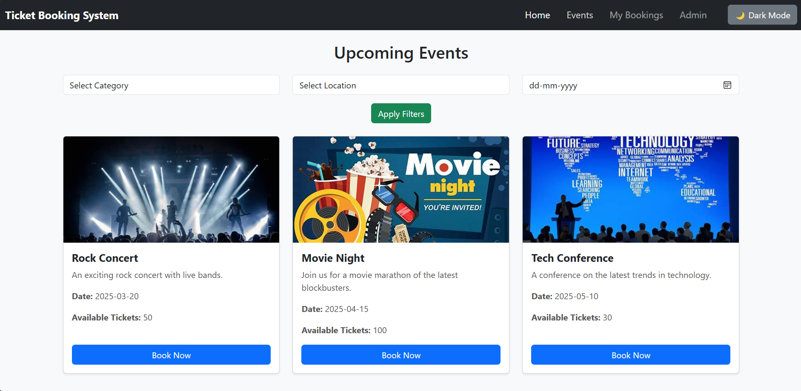
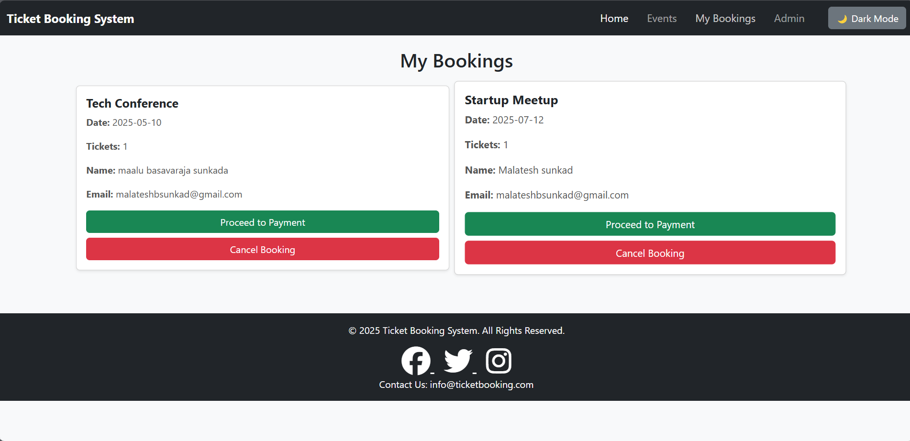
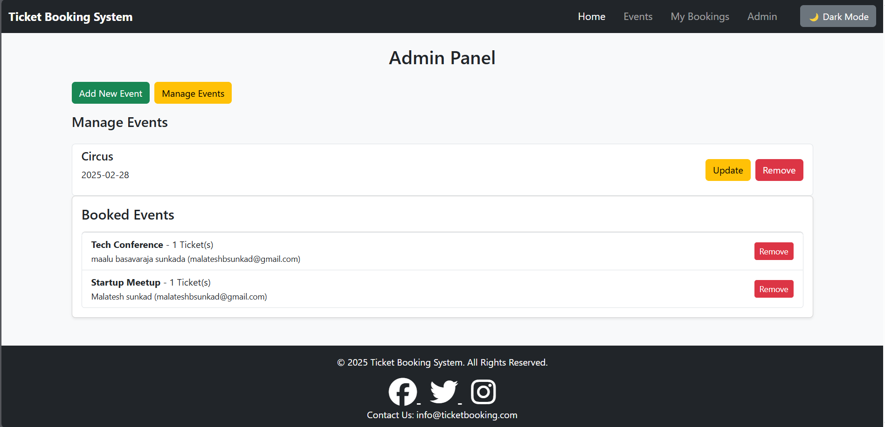

<<<<<<< HEAD
# Ticket-Booking-System
=======
# 🎟️ Ticket Booking System

## 📌 Project Description
The **Ticket Booking System** is a web-based application designed for seamless event ticket booking. Users can browse events, book tickets, manage their bookings, and proceed with secure payments. The admin panel allows event organizers to add, update, and manage events and bookings efficiently.

## 🛠️ Technologies Used
- **Frontend**: React.js (with Vite)
- **State Management**: useState, useEffect
- **Styling**: Bootstrap
- **Local Storage**: Used for managing events and bookings
- **Payment Integration**: Simulated secure payment process
- **Authentication**: Admin login functionality

## 📸 Screenshots
### 🎭 Home Page


### 📅 Events Page


### 📜 My Bookings


### 🔧 Admin Panel


## 🎥 Video Demonstration
[](https://www.youtube.com/watch?v=YOUR_VIDEO_ID)

## 🚀 Features
✔️ **User Features**
- Browse and book tickets for events
- Manage bookings and proceed with payments
- Receive email notifications on successful booking

✔️ **Admin Features**
- Add, update, and delete events
- View and manage user bookings
- Secure admin authentication

## 🏁 Getting Started
### 🔹 Installation Steps
1. Clone the repository:
   ```sh
   git clone https://github.com/your-repo/ticket-booking-system.git
   cd ticket-booking-system
   ```
2. Install dependencies:
   ```sh
   npm install
   ```
3. Start the development server:
   ```sh
   npm run dev
   ```
4. Open your browser and navigate to `http://localhost:5173`

## 📝 Future Enhancements
- Integrate a real payment gateway (Stripe/PayPal)
- Implement user authentication & profile management
- Add search & filter options for events

---
### 📬 Contact
For any queries, feel free to reach out at [your.email@example.com](mail-to:malateshbsunkad03@gmail.com).

> 🌟 **If you like this project, give it a star on GitHub!**

>>>>>>> ba298fa (Initial commit)
